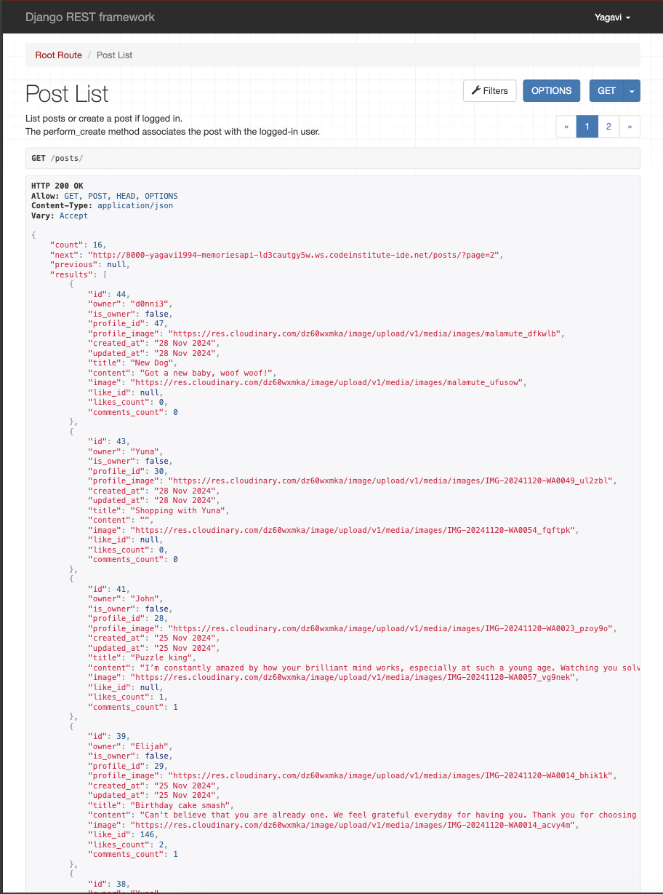

# Memories API

The **Memories API** is a backend service for a user-centered platform designed to help individuals document, share, and engage with key life events and moments. It provides functionality for creating, viewing, updating, and deleting milestones, posts, comments, likes, and more. Users can also follow each other and engage with shared content, making it an interactive space to share and celebrate life’s significant milestones.

The entire basis of this API is to facilitate and support a smooth, seamless user experience on the front-end.

The deployed API can be viewed [here](https://memories-backend-16d0ed87a1d2.herokuapp.com/)

The deployed front-end can be viewed [here](https://memories-frontend-895c7e867e2e.herokuapp.com)

The repository for the front-end can be viewed [here](https://github.com/Yagavi1994/memories)

## Table of Contents

- [Overview](#overview)
- [Database Scheme](#database-scheme)
- [Features](#features)
- [Technology Stack](#technology-stack)
- [API Models and Endpoints](#api-models-and-endpoints)
  - [Profiles](#profiles)
  - [Posts](#posts)
  - [Milestones](#milestones)
  - [Comments](#comments)
  - [Likes](#likes)
  - [Followers](#followers)
- [Deployment](#deployment)
- [Acknowledgments](#acknowledgments)

---

## Overview

The **Memories API** is built with Django Rest Framework (DRF) which serves as the backend and foundation for a front-end platform where users can log milestones, share posts, and interact with others. This project is ideal for families, professionals, and communities looking to document and share achievements, experiences, key moments and milestones of a child's life.

---

## Database Scheme 

This entity-relationship diagram shows a well-structured design for a Memories, allowing for efficient management of posts, milestones, comments, liked, followers and user profiles while ensuring smooth interaction between these entities.

---

## Features

1. **User Profiles**:
   - Automatically created upon user registration.
   - Editable details, including profile pictures, bio, username, password and privacy.

2. **Posts**:
   - Users can create, view, update and delete posts which has image, title and content.
   - Engage with posts by liking or commenting.

3. **Milestones**:
   - Document significant life events with image, title, date, age, height, weight, category and description which can be viewed, updated and deleted.
   - Users can engage with posts by liking or commenting.

4. **Interactions**:
   - Like posts or milestones to show support.
   - Comment on posts for discussions or feedback.

5. **User Connections**:
   - Follow other users to stay updated on their content.
   - View milestones and posts shared by followed users.

6. **Search and Filters**:
   - Search posts and milestones by title or owner.

7. **Media Support**:
   - Integration with Cloudinary for image and media hosting.

---

## API Models and Endpoints

### Profiles

In the Profile List section, a user can view a list of all profiles in the API.

- **Model**:
  - Fields: `owner`, `created_at`, `updated_at`, `name`, `content`, `image` and `is_private`.
- **Endpoints**:
  - `/profiles/`: View all profiles.
  - `/profiles/<int:pk>/`: Retrieve, update, or delete a specific profile.

---

### Posts

In the Posts List section, a user can view a list of all posts in the API.

- **Model**:
  - Fields: `owner`, `created_at`, `updated_at`, `title`, `content` and `image`.
- **Endpoints**:
  - `/posts/`: Create a new post or view a list of all posts.
  - `/posts/<int:pk>/`: Retrieve, update, or delete a specific post.

### Milestones

In the Milestones List section, a user can view a list of all milestones in the API.

- **Model**:
  - Fields: `owner`, `created_at`, `updated_at`, `title`, `content`, `image`, `milestone_date`, `age_years`, `age_months`, `height`, `weight` and `milestone_category`.
- **Endpoints**:
  - `/milestones/`: Create a new milestone or view a list of all milestones.
  - `/milestones/<int:pk>/`: Retrieve, update, or delete a specific milestone.

---

### Comments

In the Comments List section, a user can view a list of all comments in the API.

- **Model**:
  - Fields: `owner`, `post`, `milestone`, `content`, `created_at` and `updated_at`.
- **Endpoints**:
  - `/comments/`: Create a new comment or view a list of all comments.
  - `/comments/<int:pk>/`: Retrieve, update, or delete a specific comment.

---

### Likes

In the Likes List section, a user can view a list of all likes in the API.

- **Model**:
  - Fields: `owner`, `post`, `milestone` and `created_at`.
- **Endpoints**:
  - `/likes/`: Create a new like or view a list of all likes.
  - `/likes/<int:pk>/`: Delete a specific like.

---

### Followers

In the Followers List section, a user can view a list of all followers in the API.

- **Model**:
  - Fields: `owner`, `followed` and `created_at`.
- **Endpoints**:
  - `/followers/`: Create a new follower or view a list of all followers.
  - `/followers/<int:pk>/`: Delete a specific follower.

---

### Follow Requests

In the Follow Requests List section, a user can view a list of all follow requests in the API.

- **Model**:
  - Fields: `requester`, `receiver`, `status` and `created_at`.
- **Endpoints**:
  - `/followrequests/`: Create a new follow request or view a list of all follow requests.
  - `/follow-requests/<int:pk>/accept/'`: Accept a follow request.
  - `/follow-requests/<int:pk>/decline/'`: Decline a follow request.
  - `/follow-requests/count/'`: View follow request count.

## Technologies Used

### Languages

- [Python](<https://en.wikipedia.org/wiki/Python_(programming_language)>) - Provides the functionality for the DRF backend framework.

### Frameworks & Software

- [Django Rest Framework](https://www.django-rest-framework.org/) - A framework for building web API's
- [PEP8 Validation](https://pypi.org/project/pep8/) - pep8 is a tool to check your Python code against some of the style conventions in PEP 8.
- [Github](https://github.com/) - Used to host the repository, store the commit history and manage the project board containing user stories.
- [Heroku](https://en.wikipedia.org/wiki/Heroku) - A cloud platform that the application is deployed to.
- [Cloudinary](https://cloudinary.com/) - A service that hosts image files in the project.

### Libraries

The libraries used in this project are located in the requirements.txt file and have been documented below

- [asgiref](https://pypi.org/project/asgiref/) - ASGI is a standard for Python asynchronous web apps and servers to communicate with each other, and positioned as an asynchronous successor to WSGI.
- [cloudinary](https://pypi.org/project/cloudinary/) - The Cloudinary Python SDK allows you to quickly and easily integrate your application with Cloudinary.
- [dj-database-url](https://pypi.org/project/dj-database-url/0.5.0/) - This simple Django utility allows you to utilize the 12factor inspired DATABASE_URL environment variable to configure your Django application.
- [dj-rest-auth](https://pypi.org/project/dj-rest-auth/) - Drop-in API endpoints for handling authentication securely in Django Rest Framework.
- [Django](https://pypi.org/project/Django/) - Django is a high-level Python web framework that encourages rapid development and clean, pragmatic design.
- [django-allauth](https://pypi.org/project/django-allauth/) - Integrated set of Django applications addressing authentication, registration, account management as well as 3rd party (social) account authentication.
- [django-cloudinary-storage](https://pypi.org/project/django-cloudinary-storage/) - Django Cloudinary Storage is a Django package that facilitates integration with Cloudinary by implementing Django Storage API.
- [django-cors-headers](https://pypi.org/project/django-cors-headers/) - A Django App that adds Cross-Origin Resource Sharing (CORS) headers to responses. This allows in-browser requests to your Django application from other origins.
- [django-filter](https://pypi.org/project/django-filter/) - Django-filter is a reusable Django application allowing users to declaratively add dynamic QuerySet filtering from URL parameters.
- [django-rest-framework](https://pypi.org/project/djangorestframework/) - web-browsable Web APIs.
- [djangorestframework-simplejwt](https://pypi.org/project/djangorestframework-simplejwt/) - Simple JWT is a JSON Web Token authentication plugin for the Django REST Framework.
- [gunicorn](https://pypi.org/project/gunicorn/) - Gunicorn ‘Green Unicorn’ is a Python WSGI HTTP Server for UNIX. It’s a pre-fork worker model ported from Ruby’s Unicorn project. The Gunicorn server is broadly compatible with various web frameworks, simply implemented, light on server resource usage, and fairly speedy.
- [oauthlib](https://pypi.org/project/oauthlib/) - OAuthLib is a framework which implements the logic of OAuth1 or OAuth2 without assuming a specific HTTP request object or web framework.
- [pillow](https://pypi.org/project/Pillow/8.2.0/) - The Python Imaging Library adds image processing capabilities to your Python interpreter.
- [psycopg2](https://pypi.org/project/psycopg2/) - Psycopg is the most popular PostgreSQL database adapter for the Python programming language.
- [PyJWT](https://pypi.org/project/PyJWT/) - A Python implementation of RFC 7519.
- [requests-oauhlib](https://pypi.org/project/requests-oauthlib/) - Provides first-class OAuth library support for Requests.
- [sqlparse](https://pypi.org/project/sqlparse/) - sqlparse is a non-validating SQL parser for Python.

## Deployment

The project was deployed to [Heroku](https://www.heroku.com/). To deploy, please follow the process below:

1.  To begin with we need to create a GitHub repository from the [Code Institute template](https://github.com/Code-Institute-Org/gitpod-full-template) by following the link and then click 'Use this template'.
2.  Fill in the details for the new repository and then click 'Create Repository From Template'.
3.  When the repository has been created, click on the 'Gitpod' button to open it in the GitPod Editor.
4.  Now it's time to install Django and the supporting libraries that are needed, using the following commands:

- `pip3 install 'django<4' gunicorn`
- `pip3 install 'dj_database_url psycopg2`
- `pip3 install 'dj3-cloudinary-storage`

5.  When Django and the libraries are installed we need to create a requirements file.

- `pip3 freeze --local > requirements.txt` - This will create and add required libraries to requirements.txt

6.  Now it's time to create the project.

- `django-admin startproject YOUR_PROJECT_NAME .` - This will create the new project.

7.  When the project is created we can now create the applications. My project consists of the following apps; Profiles, Posts, Milestones, Comments, Likes, Followers and Follow Requests.

- `python3 manage.py startapp APP_NAME` - This will create an application

8.  We now need to add the applications to settings.py in the INSTALLED_APPS list.
9.  Now it is time to do our first migration and run the server to test that everything works as expected. This is done by writing the commands below.

- `python3 manage.py makemigrations` - This will prepare the migrations
- `python3 manage.py migrate` - This will migrate the changes
- `python3 manage.py runserver` - This runs the server. To test it, click the open browser button that will be visible after the command is run.

9.  Now it is time to create our application on Heroku, attach a database, prepare our environment and settings.py file and setup the Cloudinary storage for our static and media files.

- Once signed into your [Heroku](https://www.heroku.com/) account, click on the button labeled 'New' to create a new app.

10. Choose a unique app name, choose your region and click 'Create app".

11. Next we need to connect an external PostgreSQL database to the app from [ElephantSQL](https://customer.elephantsql.com/login). 

12. Back in your Heroku app settings, click on the 'Reveal Config Vars' button. Create a config variable called DATABASE_URL and paste in the URL you copied from ElephantSQL. This connects the database into the app.

13. Go back to GitPod and create a new env.py in the top level directory. Then add these rows.

- `import os` - This imports the os library
- `os.environ["DATABASE_URL"]` - This sets the environment variables.
- `os.environ["SECRET_KEY"]` - Here you can choose whatever secret key you want.

14. Back in the Heroku Config Vars settings, create another variable called SECRET_KEY and copy in the same secret key as you added into the env.py file. Don't forget to add this env.py file into the .gitignore file so that it isn't commited to GitHub for other users to find.

15. Now we have to connect to our environment and settings.py file. In the settings.py, add the following code:

`import os`

`import dj_database_url`

`if os.path.isfile("env.py"):`

`import env`

16. In the settings file, remove the insecure secret key and replace it with: `SECRET_KEY = os.environ.get('SECRET_KEY')`

17. Now we need to comment out the old database settings in the settings.py file (this is because we are going to use the postgres database instead of the sqlite3 database).

Instead, we add the link to the DATABASE_URL that we added to the environment file earlier.

18. Save all your fields and migrate the changes again.

`python3 manage.py migrate`

19. Now we can set up [Cloudinary](https://cloudinary.com/users/login?RelayState=%2Fconsole%2Fmedia_library%2Ffolders%2Fhome%3Fconsole_customer_external_id%3Dc-95a4cb26371c4a6bc47e19b0f130a1#gsc.tab=0) (where we will store our static files). First you need to create a Cloudinary account and from the Cloudinary dashboard copy the API Environment Variable.

20. Go back to the env.py file in Gitpod and add the Cloudinary url (it's very important that the url is correct):

`os.environ["CLOUDINARY_URL"] = "cloudinary://************************"`

21. Let's head back to Heroku and add the Cloudinary url in Config Vars. We also need to add a disable collectstatic variable to get our first deployment to Heroku to work.

22. Back in the settings.py file, we now need to add our Cloudinary Libraries we installed earlier to the INSTALLED_APPS list. Here it is important to get the order correct.

- cloudinary_storage
- django.contrib.staticfiles
- cloudinary

23. For Django to be able to understand how to use and where to store static files we need to add some extra rows to the settings.py file.

24. To be able to get the application to work through Heroku we also need to add our Heroku app and localhost to the ALLOWED_HOSTS list:

`ALLOWED_HOSTS = ['memories-api.herokuapp.com', 'localhost']`

25. Now we just need to create the basic file directory in Gitpod.

- Create a file called \*_Procfile_ and add the line `web: gunicorn PROJ_NAME.wsgi?` to it.

26. Now you can save all the files and prepare for the first commit and push to Github by writing the lines below.

- `git add .`
- `git commit -m "Deployment Commit`
- `git push`

27. Now it's time for deployment. Scroll to the top of the settings page in Heroku and click the 'Deploy' tab. For deployment method, select 'Github'. Search for the repository name you want to deploy and then click connect.

28. Scroll down to the manual deployment section and click 'Deploy Branch'. Hopefully the deployment is successful!

### How To Fork The Repository On GitHub

It is possible to make an independent copy of a GitHub Repository by forking the GitHub account. The copy can then be viewed and it is also possible to make changes in the copy without affecting the original repository. To fork the repository, follow these steps:

1.  After logging in to GitHub, locate the repository. On the top right side of the page there is a 'Fork' button. Click on the button to create a copy of the original repository.

### Cloning And Setting Up This Project

To clone and set up this project you need to follow the steps below.

1.  When you are in the repository, find the code tab and click it.
2.  To the left of the green GitPod button, press the 'code' menu. There you will find a link to the repository. Click on the clipboard icon to copy the URL.
3.  Use an IDE and open Git Bash. Change directory to the location where you want the cloned directory to be made.
4.  Type 'git clone', and then paste the URL that you copied from GitHub. Press enter and a local clone will be created.
5.  To be able to get the project to work you need to install the requirements. This can be done by using the command below:

- `pip3 install -r requirements.txt` - This command downloads and installs all required dependencies that is stated in the requirements file.

6.  The next step is to set up the environment file so that the project knows what variables that needs to be used for it to work. Environment variables are usually hidden due to sensitive information. It's very important that you don't push the env.py file to Github (this can be secured by adding env.py to the .gitignore-file). The variables that are declared in the env.py file needs to be added to the Heroku config vars. Don't forget to do necessary migrations before trying to run the server.

- `python3 manage.py migrate` - This will do the necessary migrations.
- `python3 manage.py runserver` - If everything i setup correctly the project is now live locally.

## Acknowledgments

- My mentor at Code Institute, Richard Wells, for code review, help and feedback. Very much appreciated!