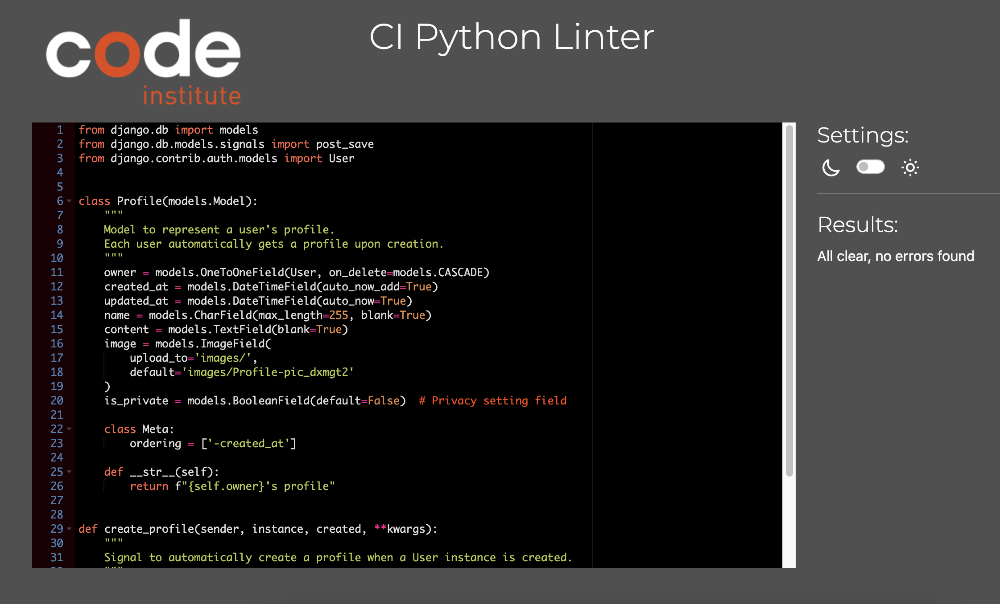

# Memories API

## Backend Testing

### Table of Contents
   - [Code Validation](#code-validation)
   - [Manual Testing](#manual-testing)
   - [C.R.U.D Testing](#crud-testing)

### Code Validation

#### PEP8

The code was validated using the [Code Institute](https://pep8ci.herokuapp.com/) Python Checker. All files passed validation and no significant issues were identified in the code.

## Manual Testing

### C.R.U.D Testing

The following CRUD Tests can be performed as an admin.

| **TEST**          | **ACTION**             | **EXPECTATION**          | **RESULT** |
| ----------------- | ---------------------- | ------------------------ | ---------- |
| Post | Create | Successfully created new posts | ✅ |
| Post | Read | Posts display correctly on the Post page | ✅ |
| Post | Update | Post edits reflect accurately | ✅ |
| Post | Delete | Post removed successfully | ✅ |
| Milestone | Create | Successfully created new milestone | ✅ |
| Milestone | Read | Milestone display correctly on the Milestone page | ✅ |
| Milestone | Update | Milestone edits reflect accurately | ✅ |
| Milestone | Delete | Milestone removed successfully | ✅ |
| Profile | Create | New Instance created in database | ✅ |
| Profile | Read | Instances and data visible in Profile Page  | ✅ |
| Profile | Update | Modifications saved & visible in the Profile Page | ✅ |
| Profile | Delete | Instance removed from database with all its data and other instances that have relation with it | ✅         |
| Comments | Create | Comment created | ✅ |
| Comments | Read | Comment visible in Commen page | ✅ |
| Comments | Update | Comment edits reflect accurately | ✅ |
| Comments | Delete | Comment removed successfully | ✅ |
| Likes | Create | Likes added to User Profile | ✅ |
| Likes | Read | Likes visible in Like page | ✅ |
| Likes | Delete | Likes removed successfully | ✅ |
| Followers | Create | Followers created | ✅ |
| Followers | Read | Followers count visible in Follower page | ✅ |
| Followers | Update | Followers update reflect accurately | ✅ |
| Followers | Delete | Followers removed successfully | ✅ |
| Follow Requests | Create | Follow Requests created | ✅ |
| Follow Requests | Read | Follow Requests visible Follow Requests  page | ✅ |
| Follow Requests | Update | Follow Requests update reflect accurately | ✅ |
| Follow Requests | Delete | Follow Requests removed successfully | ✅ |

---

### Authentication Testing

#### Registration Testing

| **Test**                  | **Action**                                                                 | **Expected Outcome**                                                                                 | **Result** |
|---------------------------|---------------------------------------------------------------------------|-------------------------------------------------------------------------------------------------------|------------|
| Valid Registration         | Send a POST request to `/dj-rest-auth/registration/` with valid `username`, `password`, and `confirm password`. | User is successfully registered, and a response containing user details and tokens is returned.       | ✅         |
| Invalid Username           | Send a POST request to `/dj-rest-auth/registration/` with a `username` that is already taken.                 | Registration fails, and an error message is returned indicating that the username is already in use.  | ✅         |
| Password Mismatch          | Send a POST request to `/dj-rest-auth/registration/` with mismatched `password` and `confirm password`.       | Registration fails, and an error message is returned indicating that the passwords do not match.      | ✅         |
| Weak Password              | Send a POST request to `/dj-rest-auth/registration/` with a weak or invalid `password`.                      | Registration fails, and an error message is returned indicating the password does not meet criteria.  | ✅         |
| Missing Fields             | Send a POST request to `/dj-rest-auth/registration/` with missing `username` or `password`.                  | Registration fails, and an error message is returned indicating the missing fields.                   | ✅         |

---

#### Login Testing

| **Test**                  | **Action**                                                              | **Expected Outcome**                                                                          | **Result** |
|---------------------------|------------------------------------------------------------------------|----------------------------------------------------------------------------------------------|------------|
| Valid Login                | Send a POST request to `/dj-rest-auth/login/` with a valid `username` and `password`. | User is successfully logged in, and a response containing user details and tokens is returned. | ✅         |
| Invalid Username           | Send a POST request to `/dj-rest-auth/login/` with an incorrect `username`.          | Login fails, and an error message is returned indicating invalid credentials.                 | ✅         |
| Invalid Password           | Send a POST request to `/dj-rest-auth/login/` with an incorrect `password`.          | Login fails, and an error message is returned indicating invalid credentials.                 | ✅         |
| Missing Fields             | Send a POST request to `/dj-rest-auth/login/` without `username` or `password`.       | Login fails, and an error message is returned indicating the missing fields.                  | ✅         |
| Token Persistence          | Log in successfully and verify the token persistence during the session.             | User remains logged in until the token expires or they log out.                               | ✅         |

These test cases ensure that the Registration and Login features work as expected and return appropriate responses for different scenarios.